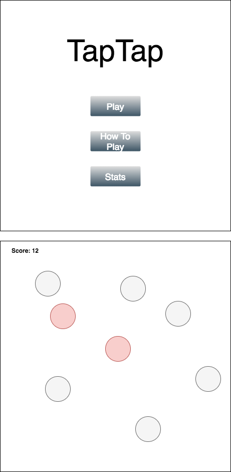

# TapTap

### Overview

TapTap (tentative name) is a game with a very simple concept. Players only need to tap or click on the circles that pop up in the screen before they disappear.

Sounds simple enough, but words can be deceiving. There are many challenges that lay ahead.

Additionally, after gameplay, users are able to view the statistics of their play including accuracy, point counts, high score, and more.

### Functionality

In TapTap, users will be able to play a fun fast-paced game.

Users will be able to see the stats of their play.

### MVPs

[ ] Have multiple levels of game play
[ ] Start, pause, exit game play
[ ] Initial gameplay directions
[ ] Statistics page - tracks session statistics

Considered features:

[ ] Special stats page: use gameplay events as data for data visualization
[ ] Track user historical gameplay statistics (or all players)

### Wireframes

App will be a single page with a menu screen on top.

Menu and Gameplay

### Implementation

- Vanilla Javascript for game logic
- `HTML5 Canvas` for rendering and gameplay
- HTML and JS for menu
- JS and CSS for styling
- Webpack to bundle scripts

Scripts -
- `game_view.js` - where the game will be displayed
- `game.js` - where game logic will be handled
- `levels.js` - where the level handling will occur
- `circle.js` - where the logic of the objects to be TapTapped will occur

### Timeline

**Weekend:**
- [x] Research into game implementation
- [x] Begin initial game logic

**Day 1:** Setup additional gameplay logic...
- [ ] Have basic level of gameplay fully implemented
  - [ ] Score tracking
  - [ ] Level time limit
- [ ] Begin implementation of the menu

**Day 2:** Implement menu
- [ ] Have full menu up and running and displaying the appropriate information
  - [ ] Play button starts the game
  - [ ] Stats page shows stats modal with gameplay points
- [ ] Implement pause button logic to return to menu

**Day 3:** Style
- [ ] Get all the game elements and menu elements looking good
- [ ] Implement game modes
  - [ ] casual
  - [ ] quick play
  - [ ] expert
  - [ ] unending

**Day 4:** Build experience
- [ ] Add sound effects and music
- [ ] Build more levels

**Day 5:** Localstorage
- [ ] Resarch localstorage and how to implement to store user scores
- [ ] Research bonus features
