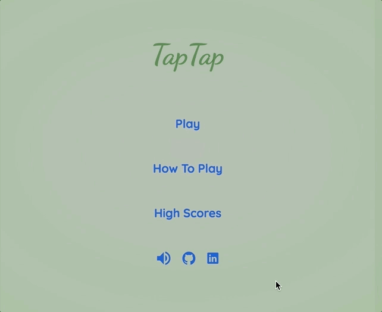
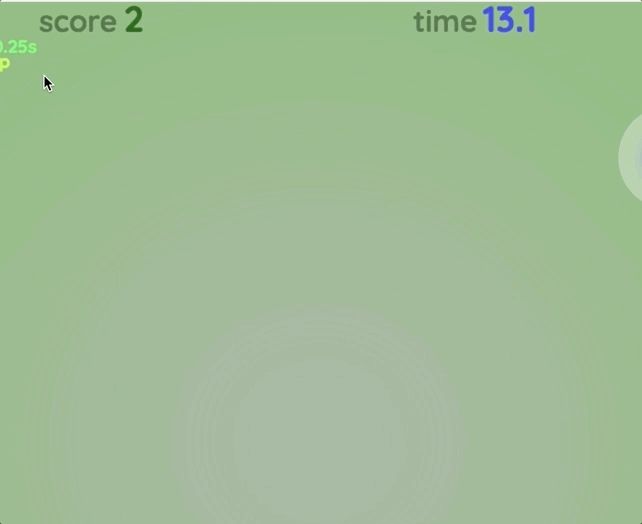

# TapTap

## Introduction
[TapTap live](https://taptaps.herokuapp.com/)

TapTap is a fun fast paced click game built with HTML5, CSS3, and vanilla Javascript. A small Node / Express backend was built to handle universal high scores.

## Features
- [Dynamic HTML elements using event listeners and CSS](#dynamic-html-elements)
- [Canvas rendering for responsive gameplay](#canvas-rendering)
- [High Scores tracked by a Node backend](#high-scores)
- [Organized Object Oriented Programming](#object-oriented)

### Dynamic HTML Elements

Implemented cleanly styled HTML elements with event listeners on each button to provide users with a responsive user experience.



[Back to Top](#taptap)

### Canvas Rendering

Objects in game are drawn directly with an HTML canvas element for smooth animations and interactive gameplay.



[Back to Top](#taptap)

### High Scores

Players can check back in with the game to see if their high scores have been beaten or not.


[Back to Top](#taptap)

#### Node Backend

The high score system was obtained by implementing a small Node backend and a couple XMLHTTPRequests to get the top high scores and to post each high score after a game ends. In order to properly receive the data, that was requested asynchronously, and without using jQuery, a promise object was made to handle the request and ensure that the data was handled properly.

```
export const fetchScores = () => {
  return new Promise((resolve, reject) => {
    const xhr = new XMLHttpRequest();
    xhr.open('GET', '/scores');
    xhr.onload = function() {
      if (this.status >= 200 && this.status < 300) {
        resolve(xhr.response);
      } else {
        reject({
          status: this.status,
          statusText: xhr.statusText
        });
      }
    };
    xhr.onerror = function() {
      reject({
        status: this.status,
        statusText: xhr.statusText
      });
    };
    xhr.send();
  });
};
```
[Back to Top](#taptap)

### Object Oriented

Code was organized to maintain robustness and minimize dependencies into the following structure.

- `api_util.js` to handle the api requests  
- `app.js` to handle the server routes  
- `menu.js` to handle the menu displays and logic  
- `game_view.js` to handle the game view  
- `game.js` to handle game logic  
- `circle.js` holds the logic for the circle objects on screen  
- `stats.js` holds record and logic for the gameplay stats  
- `message.js` holds the logic and implementation of the little messages that pop out of the circles upon click  
- `timer.js` is a reusable class that provides objects with a timer functionality  

[Back to Top](#taptap)

### In the future
- Additional circle types
- Migrate game to a mobile platform
- Incorporate daily challenges
- Incorporate a level gameplay

[Back to Top](#taptap)
